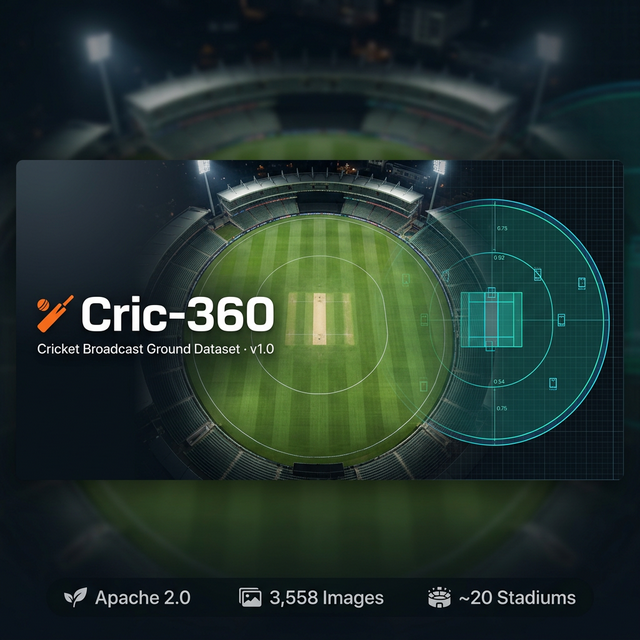

# 🏏 Cric-360: Cricket Broadcast Ground Dataset

<div align="center">



[](https://huggingface.co/datasets/sarimshahzad/Cric-360)
[](LICENSE)
[](https://huggingface.co/datasets/sarimshahzad/Cric-360)
[](#-venue-coverage)
[](#-version-history)
[](#-about-cogniqube)

**The world's first large-scale, AI-cleaned cricket broadcast ground image dataset for computer vision research.**

*Built by [CogniQube](https://cogniqube) · Led by [Sarim Shahzad](https://www.linkedin.com/in/sarim-shahzad/)*

---

### ⬇️ [Download on HuggingFace →](https://huggingface.co/datasets/sarimshahzad/Cric-360)

</div>

---

## 📖 What is Cric-360?

Cric-360 is a carefully curated collection of **3,558 broadcast-quality cricket ground frames** extracted from real live match footage, captured across **~20 international stadiums** across Asia, Africa, SENA (South Africa, England, New Zealand, Australia), and neutral venues worldwide.

Unlike existing cricket datasets focused only on action recognition or ball tracking, **Cric-360 targets the complete visual understanding of cricket broadcast scenes** — from ground segmentation to augmented reality overlays.

All images have been cleaned through a **custom AI pipeline using LaMa inpainting** to remove broadcast overlays (TV logos, scorebars), producing clean ground-truth quality frames ready for research.

> ⚠️ **This is v1.0 — an initial release.** We are actively expanding this dataset with more venues, annotations, and modalities. [See the roadmap →](#-version-history--roadmap)

---

## 🌍 Dataset Diversity

### 🏟️ ~20 International Stadiums

| Region | Coverage |
|:---|:---|
| 🌏 **Asia** | Pakistan, India, Sri Lanka, Bangladesh, UAE |
| 🌍 **Africa** | South Africa venues |
| 🏴󠁧󠁢󠁥󠁮󠁧󠁿 **England** | Premier English grounds |
| 🇦🇺 **SENA** | Australia, New Zealand stadiums |
| 🌐 **Neutral venues** | Internationally hosted matches |

### ☀️🌙 Lighting & Conditions

| | |
|:---|:---|
| ☀️ Day matches | Full sunlight, crisp shadows |
| 🌅 Day-Night | Transitional mixed lighting |
| 💡 Night matches | Full floodlights, deep shadow diversity |
| 🌥️ Overcast | Flat diffuse lighting |

### 📷 Camera Diversity

- **Wide shots** — full ground, boundary to boundary
- **Medium shots** — mid-pitch, wicket-end focused
- **Close-up shots** — tight on crease and pitch surface
- **High cameras** — overhead & spider-cam views
- **Side-on angles** — classic broadcast perspective
- **Low angles** — near-boundary, ground-level

### 🌑 Shadow Diversity

| Shadow Type | Present |
|:---|:---|
| Player shadows on pitch | ✅ |
| Stadium and stand shadows | ✅ |
| Floodlight pole shadows | ✅ |
| Carpet / pitch shadows | ✅ |
| Partial ground occlusion | ✅ |

---

## 📊 Stats at a Glance

| Property | Value |
|:---|:---|
| **Total Images** | 3,558 |
| **Primary Resolution** | 1920 × 990–1080 px |
| **Format** | JPEG |
| **Train / Val / Test** | 2,490 / 533 / 535 |
| **Split Seed** | 42 (reproducible) |
| **Cleaning** | LaMa AI inpainting |
| **License** | Apache 2.0 |

### Quality Breakdown

| Tier | Count | % |
|:---|---:|---:|
| 🟢 HD (≥1920×1080) | 424 | 11.9% |
| 🔵 HD-Ready | 3,072 | 86.3% |
| 🟡 SD | 61 | 1.7% |
| **Total** | **3,558** | |

---

## 🎯 Use Cases & Applications

Cric-360 is a **multi-purpose foundation dataset**. It powers research across a wide range of computer vision tasks:

### 📦 Segmentation
| Task | Description |
|:---|:---|
| **Ground Segmentation** | Pitch, outfield, boundary rope, grass types, stands |
| **Player Segmentation** | Isolate players from diverse ground textures |
| **Shadow Segmentation** | Natural + artificial shadow masks |

### 🎯 Detection & Tracking
| Task | Description |
|:---|:---|
| **Ball Tracking** | Ground-plane context for trajectory models |
| **Player Tracking** | Multi-angle diversity for robust detectors |
| **Ad Board Detection** | Physical and virtual advertisement boards |

### 🗺️ Geometry & Calibration
| Task | Description |
|:---|:---|
| **Homography Estimation** | Broadcast → top-down pitch plane mapping |
| **Camera Calibration** | Intrinsic/extrinsic estimation |
| **3D Reconstruction** | Depth and geometry from diverse angles |

### 🎮 AR & Broadcast Enhancement
| Task | Description |
|:---|:---|
| **Virtual Ad Insertion** | Clean ground plane for digital ad overlays |
| **3D Logo Placement** | Ground surface for AR brand overlays |
| **Broadcast Cleaning** | Scorebar/logo removal pipeline |
| **Virtual Pitch Replacement** | Synthetic pitch overlays for broadcast |

### 🤖 Scene Understanding
| Task | Description |
|:---|:---|
| **Depth Estimation** | Monocular depth on complex stadium scenes |
| **Lighting Estimation** | Shadow diversity for illumination models |
| **Domain Adaptation** | Synthetic → real cricket distribution bridge |

---

## 🧹 AI Cleaning Pipeline

```
Raw Broadcast Frame
       │
       ▼
┌──────────────────────────────┐
│   Step 1: TV Logo Removal    │  LaMa inpainting on corner regions
└──────────────────────────────┘
       │
       ▼
┌──────────────────────────────┐
│   Step 2: Scorebar Removal   │  Mirror-pad trick → photorealistic fill
└──────────────────────────────┘
       │
       ▼
┌──────────────────────────────┐
│   Step 3: QA Verification    │  Manual spot-check of inpainted regions
└──────────────────────────────┘
       │
       ▼
  Clean Broadcast Frame ✅
```

> **First dataset to publicly document AI-based overlay removal as part of sports dataset curation.**

---

## ⬇️ Download & Usage

### Via 🤗 HuggingFace Datasets *(Recommended)*

```python
from datasets import load_dataset

ds = load_dataset("sarimshahzad/Cric-360")

# Access samples
for sample in ds["train"]:
    image = sample["image"]          # PIL Image
    print(image.size, sample["quality"], sample["has_carpet"])
```

### Via HuggingFace CLI

```bash
pip install huggingface_hub
huggingface-cli download sarimshahzad/Cric-360 --repo-type dataset --local-dir ./Cric-360
```

### Via Git LFS

```bash
git lfs install
git clone https://huggingface.co/datasets/sarimshahzad/Cric-360
```

🔗 **Full dataset page:** [huggingface.co/datasets/sarimshahzad/Cric-360](https://huggingface.co/datasets/sarimshahzad/Cric-360)

---

## 📁 Repository Contents

```
Cric360-Dataset/
├── assets/
│   └── banner.png           ← Repo banner
├── metadata.csv             ← Per-image metadata (3,558 rows)
├── dataset_stats.json       ← Summary statistics
└── README.md
```

> ℹ️ The actual images live on HuggingFace (1.16 GB). This repo contains metadata and documentation only.

---

## 🔭 Version History & Roadmap

### ✅ v1.0 — Current *(March 2025)*
- 3,558 AI-cleaned broadcast frames
- ~20 international stadiums
- Day, day-night, and night conditions
- All camera angles and frame distances
- Train / Val / Test split with full metadata

### 🚀 Planned — v2.0+
- [ ] Semantic segmentation masks
- [ ] Player bounding box annotations
- [ ] Homography ground-truth matrices
- [ ] 10,000+ image target
- [ ] Carpet / no-carpet hand-verified labels
- [ ] Night-only and Asia-only subsets

> ⭐ **Star this repo** to get notified of updates!

---

## 📜 Citation

If you use Cric-360 in your research, please cite:

```bibtex
@dataset{cric360_2025,
  author       = {Shahzad, Sarim and {CogniQube}},
  title        = {Cric-360: A Cricket Broadcast Ground Dataset for Computer Vision (v1.0)},
  year         = {2025},
  publisher    = {Hugging Face},
  organization = {CogniQube},
  url          = {https://huggingface.co/datasets/sarimshahzad/Cric-360},
  note         = {Version 1.0 — initial release}
}
```

---

## 🏢 About CogniQube

<div align="center">

**CogniQube** is an AI research and computer vision company building tools and datasets at the intersection of sports, broadcast media, and deep learning.

| | |
|:---|:---|
| 🌐 Website | [cogniqube](https://cogniqube) |
| 🤗 HuggingFace | [@sarimshahzad](https://huggingface.co/sarimshahzad) |
| 👤 Lead Researcher | **Sarim Shahzad** |

</div>

---

## 🔗 Related Work

| Dataset | Domain | Notes |
|:---|:---|:---|
| [SoccerNet](https://www.soccer-net.org/) | Soccer | Broadcast video + events |
| [WorldCup2014](https://nhoma.github.io/) | Soccer | Homography / registration |
| CricShot10 | Cricket | Shot classification only |

> ⚠️ No comparable cricket *ground* dataset exists publicly. **Cric-360 is the first.**

---

## 📬 Contact

- 🐛 Issues & suggestions: [Open an issue](https://github.com/cogniqube/Cric360-Dataset/issues)
- 🤗 Dataset page: [HuggingFace Community tab](https://huggingface.co/datasets/sarimshahzad/Cric-360/discussions)
- 🤝 Collaboration: Open to annotation partners and research groups

---

<div align="center">

*Apache 2.0 ·  For academic and commercial use with attribution*

**CogniQube © 2026 · Cric-360 v1.0**

*The beginning of cricket computer vision research 🏏*

</div>
